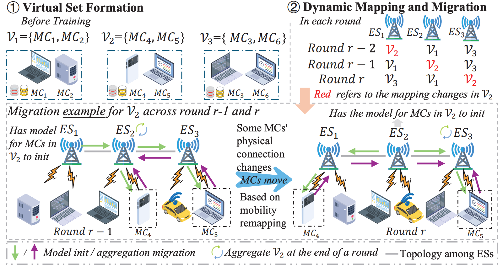

# HFL-M3

## Accelerating Hierarchical Federated Learning under Mobility via Model Migration in Cloud–Edge–End Collaborative Networks

The paper has been submitted by IEEE Trans. Mobile Comput.

**Title:** Accelerating Hierarchical Federated Learning under Mobility via Model Migration in Cloud–Edge–End Collaborative Networks

**Author:** Jian Tang, Xiaoyu Xia, Ibrahim Khalil, Mengsha Kou, Minghui Liwang, Jer Shyuan Ng, Xiuhua Li, and Xianbin Wang

<p align="center">
  <br>
  <em>The HFL-M3 framework.</em>
</p>

## Overview

The workflow has four stages:

1. Prepare the federated client data.
2. Generate a SLAW [1] client mobility trace with BonnMotion [2].
3. Construct the virtual groups with the HEonGPU [3] BFV private Gram protocol.
4. Train Proposed using the prepared data, groups and trace.

## Installation

Use Python 3.10 or later. Use Linux with an NVIDIA GPU for HEonGPU preprocessing.

```bash
git clone git@github.com:kt4ngw/HFL-M3.git
cd HFL-M3

conda create -n hflm3 python=3.10 -y
conda activate hflm3
```

Install a matching `torch` / `torchvision` pair for your CPU or CUDA environment, then install the project dependencies:

```bash
python -m pip install -r requirements.txt
```

Run all commands below from the repository root. Complete the HEonGPU and BonnMotion setup before preparing groups and mobility.

## Build HEonGPU

Run these steps **on the Linux GPU server**, from the HFL-M3 repository root.
Use the same **`hflm3` Conda environment** for compilation, group preparation and
training. Python requirements alone do not install the native compiler dependencies.

### 1. Install the compiler dependencies in hflm3

```bash
conda activate hflm3
conda install --override-channels \
  -c nvidia/label/cuda-12.6.3 -c conda-forge \
  cmake=3.31 ninja ntl=11.5.1 gxx_linux-64=12 zlib openssl \
  cuda-nvcc cuda-cudart-dev cuda-cccl libcurand-dev -y

# Reload the environment's compiler configuration.
conda deactivate
conda activate hflm3
cmake --version
nvcc --version
```

### 2. Prepare HEonGPU 1.1.3 source

Reuse the existing source directory if it is already present. Apply the included
missing-`<tuple>` header fix only if it has not already been applied:

```bash
mkdir -p "$HOME/tools"
if [ ! -d "$HOME/tools/HEonGPU-v1.1.3" ]; then
  git clone --branch v1.1.3 --depth 1 \
    https://github.com/Alisah-Ozcan/HEonGPU.git "$HOME/tools/HEonGPU-v1.1.3"
fi

if ! git -C "$HOME/tools/HEonGPU-v1.1.3" apply --reverse --check \
  "$PWD/native/heongpu/patches/0001-include-tuple.patch" 2>/dev/null; then
  git -C "$HOME/tools/HEonGPU-v1.1.3" apply \
    "$PWD/native/heongpu/patches/0001-include-tuple.patch"
fi
```

### 3. Build and install HEonGPU

Use the directories below to avoid reusing compiler paths cached by an earlier
environment. The configure step downloads HEonGPU's third-party dependencies.

```bash
export HEONGPU_ROOT="$HOME/.local/heongpu-v1.1.3-hflm3"
# Set this to the compute capability of your GPU, without the dot:
#   RTX 40 series (Ada): 89   RTX 30 series / A10 (Ampere): 86
#   A100 / A800: 80          H100 / H800: 90
# Look it up with: nvidia-smi --query-gpu=compute_cap --format=csv,noheader
export CUDA_ARCH=89

cmake -S "$HOME/tools/HEonGPU-v1.1.3" \
  -B "$HOME/tools/HEonGPU-v1.1.3/build-hflm3" -G Ninja \
  -DCMAKE_BUILD_TYPE=Release \
  -DCMAKE_INSTALL_PREFIX="$HEONGPU_ROOT" \
  -DCMAKE_CUDA_ARCHITECTURES="$CUDA_ARCH" \
  -DHEONGPU_CUDA_ARCH_FORCE_MANUAL=ON \
  -DCUDAToolkit_ROOT="$CONDA_PREFIX" \
  -DCMAKE_CUDA_COMPILER="$CONDA_PREFIX/bin/nvcc" \
  -DTHRUST_INCLUDE_DIR="$CONDA_PREFIX/targets/x86_64-linux/include" \
  -DCMAKE_PREFIX_PATH="$CONDA_PREFIX"
cmake --build "$HOME/tools/HEonGPU-v1.1.3/build-hflm3" --parallel 4
cmake --install "$HOME/tools/HEonGPU-v1.1.3/build-hflm3"
```

### 4. Build and validate the project adapter

Stay in the HFL-M3 repository root with `hflm3` active:

```bash
export CMAKE_BIN="$CONDA_PREFIX/bin/cmake"
export CUDA_ROOT="$CONDA_PREFIX"
export HEONGPU_ROOT="$HOME/.local/heongpu-v1.1.3-hflm3"
export NTL_ROOT="$CONDA_PREFIX"
export CUDA_ARCH=89   # same value as in the HEonGPU build above
export BUILD_DIR="$PWD/build/heongpu-hflm3"
bash scripts/tools/build_heongpu_backend.sh

# Update the executable used by the default Python interface.
mkdir -p build/heongpu
cp "$BUILD_DIR/private_gram_gpu" build/heongpu/private_gram_gpu
unset BUILD_DIR HFLM_HEONGPU_GRAM_BIN
python -m pytest tests/test_private_gram_gpu.py -q
```

Expect **`1 passed`**, not a skipped test. Keep `hflm3` and the installed HEonGPU
libraries in place: the executable uses them at runtime. Continue using
`conda activate hflm3` for data preparation, grouping and training.
See [the backend README](native/heongpu/README.md) for custom paths.

## Install BonnMotion 3.0.1 for SLAW

Build BonnMotion directly on the Linux experiment server using a Conda JDK.
The setup below was verified with BonnMotion 3.0.1 compiled against OpenJDK
**8.0.472**. It uses this repository's `hflm3` environment and a persistent
installation under `~/tools/`.

```bash
conda activate hflm3
conda install -c conda-forge openjdk=8.0.472 -y

"$CONDA_PREFIX/bin/java" -version
"$CONDA_PREFIX/bin/javac" -version

mkdir -p "$HOME/tools"
curl -fL --retry 3 \
  https://bonnmotion.sys.cs.uos.de/src/bonnmotion-3.0.1.zip \
  -o "$HOME/tools/bonnmotion-3.0.1.zip"
unzip -n "$HOME/tools/bonnmotion-3.0.1.zip" -d "$HOME/tools"

(
  cd "$HOME/tools/bonnmotion-3.0.1"
  ./install <<< "$CONDA_PREFIX/bin"
  ./bin/bm -hm SLAW
)

export BONNMOTION_HOME="$HOME/tools/bonnmotion-3.0.1"
```

The installer receives the active environment's Java binary directory and
compiles the sources automatically. Both `java` and `javac` are required;
the final command should display BonnMotion 3.0.1 and SLAW help.

Keep the installation path free of spaces. The launcher records the Java and
BonnMotion paths, so rerun the installer if either installation moves. In a
new shell, activate the environment and export `BONNMOTION_HOME` again.
The preparation script also detects `~/tools/bonnmotion-3.0.1/bin/bm`, or accepts
`--bonnmotion_bin /path/to/bonnmotion/bin/bm` for another location.

## Quick start: Fashion-MNIST

This example uses the paper's scale of **200 clients and 10 edge servers** with SLAW mobility, but trains for **one cloud round** so the workflow can be verified quickly.

### 1. Download and partition the data

```bash
python - <<'PY'
from torchvision.datasets import FashionMNIST
FashionMNIST(root="data", train=True, download=True)
FashionMNIST(root="data", train=False, download=True)
PY

python scripts/prepare_federated_data.py \
  --dataset_name fashionmnist --num_of_clients 200 \
  --dirichlet 0.1 --seed 2025
```

The data loader expects the four compressed IDX files in `data/FashionMNIST/raw/`. Client partitions are written under `data/federated_data/`.

### 2. Prepare mobility

```bash
python scripts/prepare_slaw_mobility.py \
  --num_of_clients 200 --num_of_edges 10 \
  --round_num 2000 --edge_epoch 2 --mobility_seeds 2025
```

`--round_num` and `--edge_epoch` here set the length of the generated trace,
not the training schedule. Generate the trace once with a length that covers
the longest experiment you plan to run; shorter training runs, such as the
one-round example below, reuse a prefix of the same trace.

### 3. Prepare private virtual groups

```bash
export LD_LIBRARY_PATH="$NTL_ROOT/lib:$CONDA_PREFIX/lib:${LD_LIBRARY_PATH:-}"

CUDA_VISIBLE_DEVICES=0 python scripts/prepare_private_virtual_groups.py \
  --privacy_backend heongpu_gpu \
  --dataset_name fashionmnist --dirichlet 0.1 \
  --num_of_clients 200 --num_of_edges 10 --num_classes 10 \
  --seed 2025
```

The prepared groups are cached under `artifacts/virtual_groups/`. Existing
matching caches are reused, so this step can be skipped for the quick start:
the repository ships the cache for exactly this configuration, together with
its `.privacy.json` runtime record. Add `--force` only when deliberately
regenerating a cache, after preserving any version needed for earlier
experiments.

The default BFV polynomial degree is `8192` and plaintext modulus is `33832961`.
The preparation command checks the recovered Gram matrix against a plaintext
reference before saving groups.

### 4. Train Proposed

```bash
python main.py --server proposed \
  --dataset_name fashionmnist --model_name fmnist_cnn \
  --num_of_clients 200 --num_of_edges 10 --num_classes 10 \
  --dirichlet 0.1 --group_distribution private_gram --group_seed 2025 \
  --mobility_model slaw --mobility_seed 2025 \
  --round_num 1 --local_epoch 1 --edge_epoch 1 \
  --seed 2025 --mapping_search_passes 3 --gpu 0
```

Use `--gpu -1` for CPU model training; HEonGPU preprocessing still requires an NVIDIA GPU. The dataset, partition, client/edge counts and group seed must match the preparation steps.

Training writes `accuracy_metrics.json` and `latency_metrics.json` under `result/`.

## Repository layout

```text
main.py                        Proposed training entry point
src/fed_cloud/proposed.py      Dynamic mapping and group aggregation
src/fed_cloud/base_cloud.py    Shared training infrastructure
src/fed_client/                Client training
src/virtualset/                Virtual-group construction and BFV interfaces
src/network_latency.py         Directed-link FCFS latency simulation
src/mobility.py                Mobility trace handling
src/models/                    Model definitions
scripts/prepare_*.py           Data, mobility and group preparation
native/heongpu/                HEonGPU backend source and build configuration
tests/                         HEonGPU backend integration test
```

## Citation

If you use this code or build upon it, please cite the paper:

```bibtex
@article{tang2026hflm3,
  title   = {Accelerating Hierarchical Federated Learning under Mobility via Model Migration in Cloud-Edge-End Collaborative Networks},
  author  = {Tang, Jian and Xia, Xiaoyu and Khalil, Ibrahim and Kou, Mengsha and Liwang, Minghui and Ng, Jer Shyuan and Li, Xiuhua and Wang, Xianbin},
  year    = {2026}
}
```

## License

Academic and non-commercial research use only; see [LICENSE](LICENSE).

Utility code in `src/utils/torch_utils.py`, `src/optimizers/gd.py`,
`src/utils/metrics.py` and `src/getdata.py` is partly adapted from
[lx10077/fedavgpy](https://github.com/lx10077/fedavgpy) (MIT), the TensorFlow
MNIST tutorial (Apache 2.0) and Stanford CS231n; see LICENSE for details.

## References

1. K. Lee, S. Hong, S. J. Kim, I. Rhee and S. Chong, "SLAW: Self-Similar Least-Action Human Walk," in IEEE/ACM Transactions on Networking, vol. 20, no. 2, pp. 515-529, Apr. 2012.
2. N. Aschenbruck, R. Ernst, E. Gerhards-Padilla, and M. Schwamborn, "BonnMotion: A Mobility Scenario Generation and Analysis Tool," in *Proc. SIMUTools*, 2010.
3. A. Özcan and E. Savaş, "HEonGPU: A GPU-based Fully Homomorphic Encryption Library 1.0," IACR Cryptology ePrint Archive, Report 2024/1543, 2024. https://github.com/Alisah-Ozcan/HEonGPU

